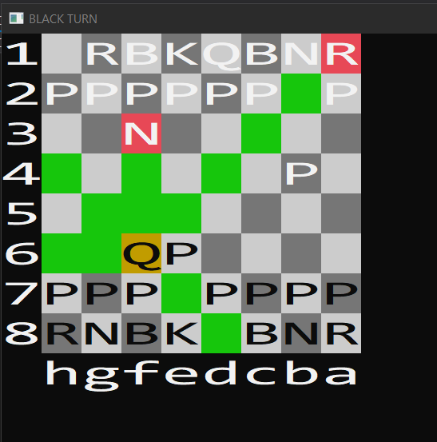
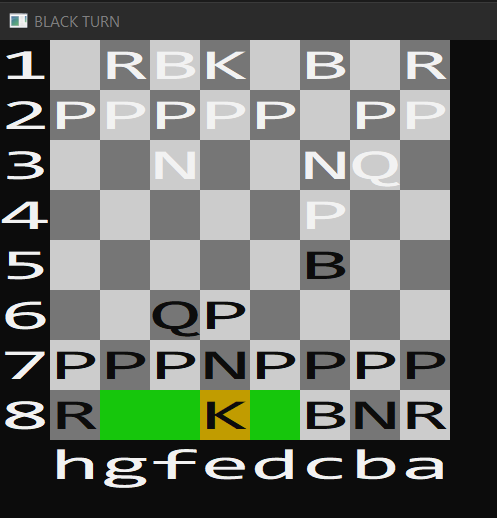

Chess engine
=====

Description
---------
This Project is a full implementation of Chess game including all rules, mechanics and conditions of the oficial Chess.
This is going to be upgraded and optimised in the future. It is possible to play against another person or a simple bot 
that makes random moves. Chess engine uses command pattern to record the game and to check the legality of the moves. Game 
log is created upon finishing the game containing recorded game in standard Chess notation.

Features
---------
- All special rules implemented: pawn promotion, pawn double move, castling and en passant
- GameLog.txt that contains recorded game
- Stepping back and forth through the game upon finishing
- Calculated score and score differences of the captured pieces
- All special conditions for draws
- Game state is updated in the window title