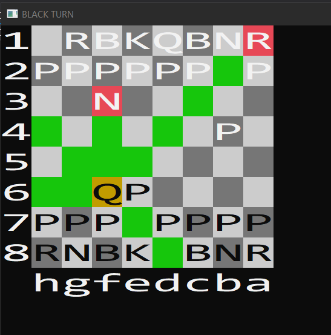
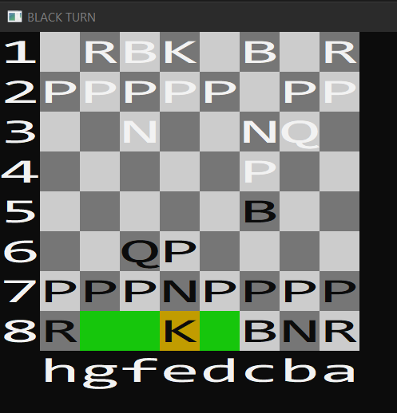
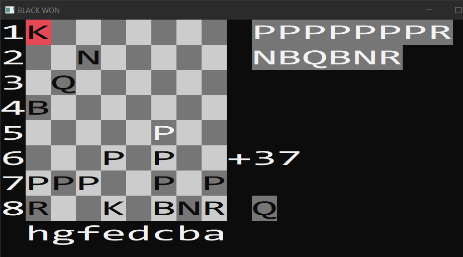

2D Console engine
=====

Description
---------
This is an implementation of a simple 2d engine in windows console with projects and animations included. Engine is a greatly 
simplified version of olcConsoleGameEngine by javidx9. Text might look stretched, because, normally text has 2:1 relation between
height and width but for squares to look like squares that relation must be 1:1 and console doesn't support different sized symbols.
Therefore text has twice the width. 

All graphics are implemented by employing ASCII characters and are displayed by using Windows function WriteConsoleOutput. 
Engine accepts keyboard and mouse input by utilizing GetAsyncKeyState and ReadConsoleInput accordingly. Output of these functions 
is then converted to three states for each key: pressed, released, held. Besides Engine class Engine.h also contains: Timer class 
for timing functions and any scopes, Position class for representing two-dimensional coordinates and simplifying certain operations, 
Command and CommandHistory classes for the use of undo/redo functionality and recording certain events

The entire engine is written in the header Engine.h. To use the engine a project class must inherit from the 
Engine class. Every project inherits from an Engine class. 

Console width, height and buffer size in console defaults and properties must be set to the same values that an engine constructor sets in project's main file. See mainChess.cpp, mainSnake.cpp, mainLife.cpp, etc for details. Otherwise the scrollbars will appear on the console window
	
Projects: 
- Chess engine

Animations: 
- trigonometric graphs
- matrix from the movie

Compiling & Running
---------
The project was built with standard MSVC and Visual Studio 2019

Chess engine
---------
Standard game of Chess, full implementation of all the rules and mechanics

Animations

MovieMatrix
---------
A console representation of the matrix inspired by the movie.

Graphs
---------
First project features 8 trigonometric functions and a pointers moving on the graph coordinates.

