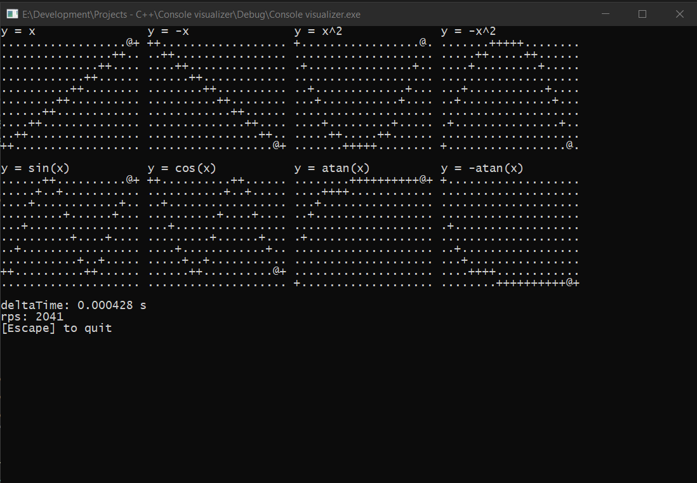

Console Visualiser
=====

Description
---------

This is a learning project in C++. I am exploring some ideas I've come up with while learning C++.
Currently features a very basic framework for drawing 2d graphics using ASCII characters, menu, 
keyboard input handling and benchmarking class. 

I am currently working on a few games and ideas to add to this project.

Important
---------
For correct display the console properties and default settings must be changed to the following
Screen buffer size
width: 100
height: 40

Window size
width: 100
height: 40

Compiling & Running
---------
Currently a standard VS2019 is used for building and compiling the project (Currently looking into the advantages of using g++)

Trigonometric functions
---------
Features 8 graphs that describe 8 functions.