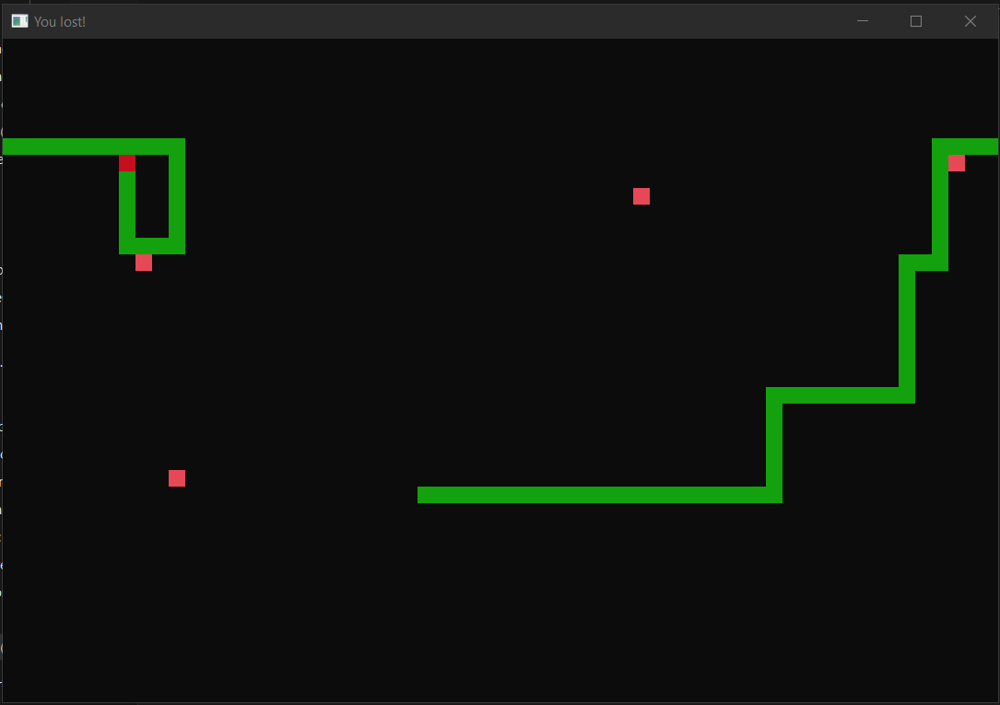

Snake
=====

Description
---------
Standard game of snake. Eat food, get longer, score as much as possible.
The movement is implemented by assigning position of the next piece of 
body (the one closer to the head) to the previous piece and then updating
position of the head.

Features
---------
- Snake wraps around the screen
- Score is displayed in the window title
- Game is over if you collide with your body